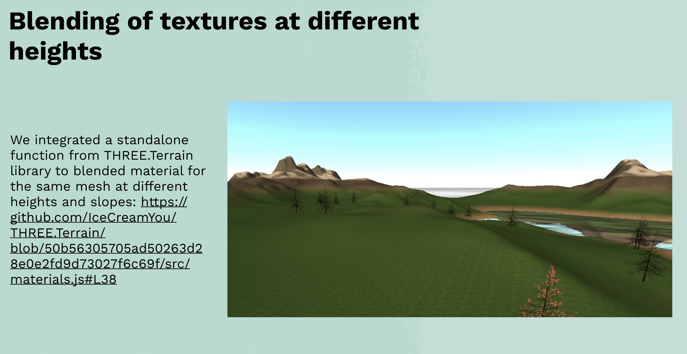
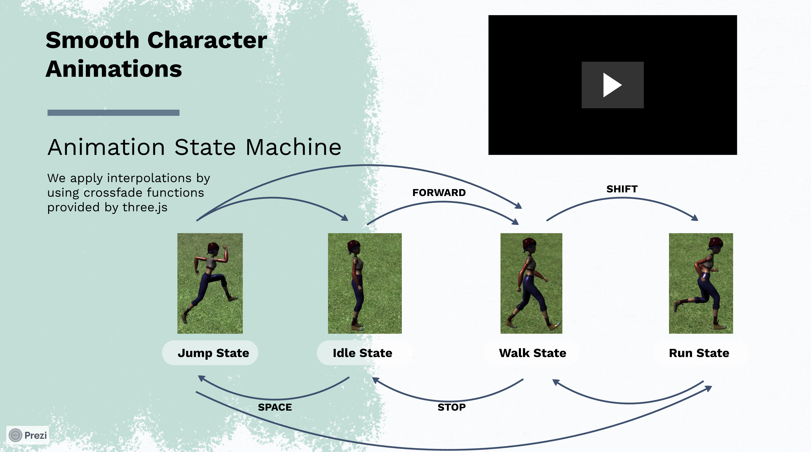
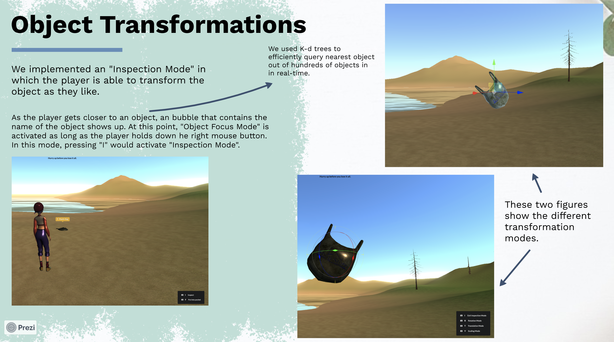
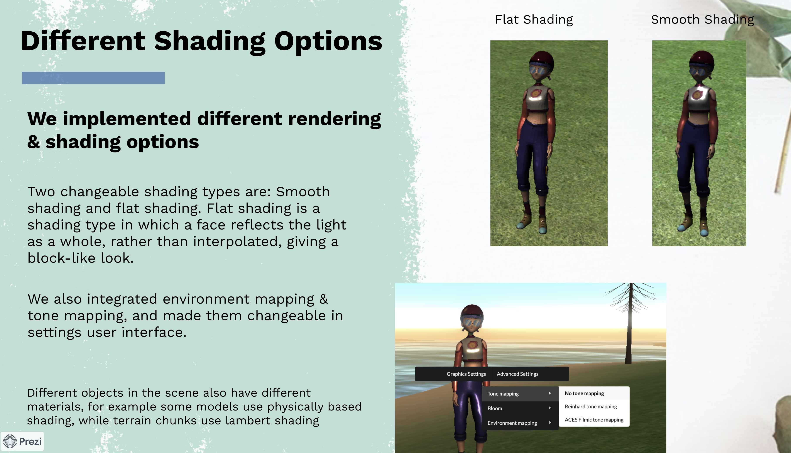

# Your Call for All
<em>Your Call for All</em> is a walking simulation made as a term project of <em>BBM412 - Introduction to Computer Graphics Course of Hacettepe University</em> with the theme of environmental problems. The game begins in a nasty looking environment in which a lot of waste has accumulated. Our character has to do something about the them, as she sees by traveling around the endless open world. The environment becomes more and more beautiful as good decisions being made.
 

You can play the game on your browser [Play](https://sce-nery.github.io/Your-Call-for-All/public_html/index.html) 
  
Also watch the [Trailer](https://www.youtube.com/watch?v=SJUABrbwMZk) 

## Some Features & Techniques Used

## Contributing

When starting to work on an issue, you need to create a branch from the `main` branch with the convention:

> `short-description-of-the-task` 

For example, if you're starting to work on "tree animations", you first need to create a branch named `tree-animations` from the `main` branch. Then you can start working on that branch. You also should synchronize your branch with `main` branch by merging `main` branch into your branch (in this case `tree-animations`) periodically.

When you are about to commit, your commit message needs to follow these conventions stated here: [How to Write a Git Commit Message](https://chris.beams.io/posts/git-commit/)   

After your task is done, you need to create a pull request. Note that you need to merge `main` branch to your branch before the pull request to minimize the chances of merge conflicts. 

And remember, the internet is your friend, consult internet whenever you stuck, as well as your teammates.

## Authors
 
-  [Çağatay Yiğit](https://github.com/cagatayyigit)
-  [Ecem Varma](https://github.com/EcemVarma)
-  [M. Şamil Ateşoğlu](https://github.com/shamilatesoglu)
